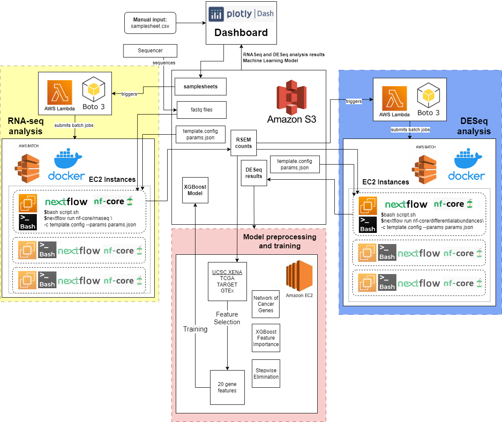

# ZB4171 - Team Kazoo: Bioinformatic Project
## _Automatic Workflow Implementation in Bioinformatic Analysis_
___

### Description

This projects presents an automatic bioinformatic analysis workflow implemented using AWS cloud architecture, with a machine learning model and updating dashboard. RNA-seq analysis is automatically triggered upon submission of a samplesheet on the dashboard using AWS Lambda and boto3, firing up AWS Batch jobs. Resulting gene quantification files are written into AWS S3 where it triggers DESeq analysis  automatically ever couple analysis. DESeq results are used as training data for the XGBoost machine learning model. The dashboard presents analysis results and allows users to select analyzed data or upload data to make predictions using the machine learning model.

___
### Dashboard
The dashboard is implemented in Python using the Dash package.
The dashboard can be hosted locally with the following commands:
```sh
pip install -r dashboard/requirements.txt
python dashboard/app/app.py
```

##### Home page

The Home page allows users to upload a samplesheet to initate RNA-seq analysis runs.

##### Patient Metadata page

The Patient Metadata page provides clinical information about the samples that have been analyzed. This is done through data plots that summarizes the data and a data table that allows users to select the clinical information to display.

##### MultiQC Report page

The MultiQC Report page provides a data table on every metric in the MultiQC report produced by the RNA-seq analysis. Users can select which metrics to display and also plot a histogram to look at the distribution of the metrics.

##### DESeq page

The DESeq page presents DESeq analysis results. MA and volcano plots are presented, along with a data table showcasing the significantly up/down regulated genes. GO enrichment analysis was also carried out to generate hypothesis about underlying biological phenomena.

##### Machine Learning page

The Machine Learning page allows users to make predictions using the XGBoost model on analyzed or uploaded data. 

___
### Acknowledgements
This project was done during AY22/23 Sem1 ZB4171 by Matthias Lim, Chua Yusong and Ong Min Xian under the guidance of Professor Greg Tucker-Kellogg.
